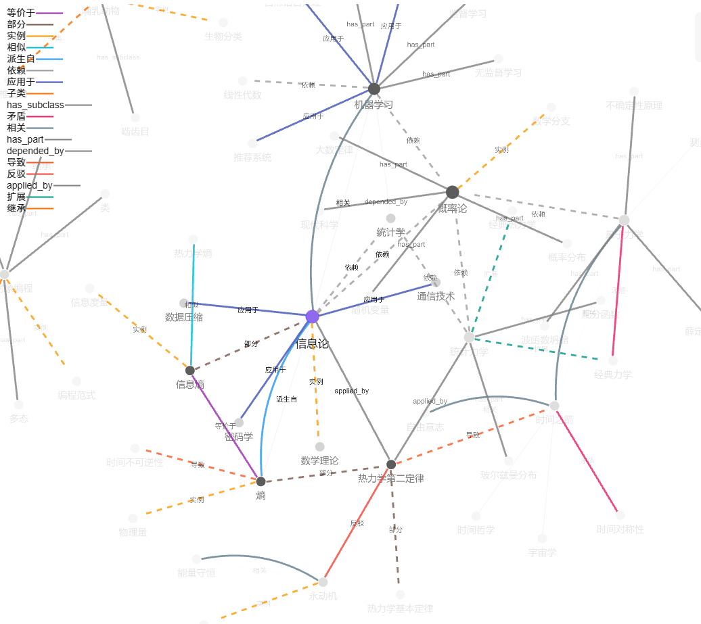

# Vassago - Graph Relation Types

> *揭示隐藏的关联，连接知识的过去与未来*

Vassago 是一个 Obsidian 插件，在图视图中显示带语义的关系边。通过从 `ob_relation/` 目录读取自定义样式配置，让你的知识图谱更加清晰、富有表现力。



## ✨ 特性

- 🎨 **自定义边样式**：为不同类型的关系定义颜色、形状（直线/曲线）、图案（实线/虚线）
- 🏷️ **语义标签**：在图视图中显示关系类型名称
- 🎯 **方向控制**：支持 outgoing、incoming、bidirectional 三种方向
- 📊 **图例显示**：自动生成关系类型图例
- ⚙️ **灵活配置**：通过 frontmatter 定义关系，通过配置文件定义样式
- 🔄 **实时更新**：修改配置后自动刷新图视图

## 📦 安装

### 从社区插件安装（推荐）

1. 打开 Obsidian 设置
2. 进入 **Community plugins** → **Browse**
3. 搜索 "Vassago"
4. 点击 **Install**，然后 **Enable**

### 手动安装

1. 下载最新的 release
2. 解压到 `<vault>/.obsidian/plugins/obsidian-vassago/`
3. 重新加载 Obsidian
4. 在设置中启用插件

## 🚀 快速开始

### 1. 安装依赖

Vassago 依赖 [Dataview](https://github.com/blacksmithgu/obsidian-dataview) 插件来读取笔记元数据。请先安装并启用 Dataview。

### 2. 创建关系类型配置

在 vault 根目录创建 `ob_relation/` 文件夹，然后为每种关系类型创建一个 `.md` 文件。

**示例：`ob_relation/supports.md`**

```yaml
---
$color: "#4CAF50"
$shape: straight
$pattern: solid
$width: 2
$arrow: true
$direction: outgoing
$inverse: "supported_by"
$label: "支持"
$description: "表示A支持/证实B的观点"
---

# supports（支持）

当节点A的内容支持、证实或强化节点B时使用此关系。
```

### 3. 在笔记中使用关系

在笔记的 frontmatter 中定义关系：

```yaml
---
supports: "[[目标笔记]]"
derived_from:
  - "[[来源1]]"
  - "[[来源2]]"
equivalent_to: "[[等价概念]]"
---
```

### 4. 查看图视图

打开图视图，你会看到带有颜色和标签的关系边！

## 📖 配置说明

### 关系类型配置

每个关系类型配置文件包含以下字段：

| 字段 | 类型 | 说明 | 示例 |
|------|------|------|------|
| `$color` | string | 边的颜色（hex） | `"#4CAF50"` |
| `$shape` | string | 线条形状：`straight`/`curved` | `"straight"` |
| `$pattern` | string | 线条图案：`solid`/`dashed` | `"solid"` |
| `$width` | number | 线宽 | `2` |
| `$arrow` | boolean | 是否显示箭头 | `true` |
| `$direction` | string | 方向：`outgoing`/`incoming`/`bidirectional` | `"outgoing"` |
| `$inverse` | string | 反向关系类型名 | `"supported_by"` |
| `$label` | string | 在图上显示的标签 | `"支持"` |
| `$description` | string | 描述（可选） | `"表示A支持B"` |

> **注意**：所有配置项必须使用 `$` 前缀，以防止与 Obsidian 内部变量冲突。

### 方向说明

- **outgoing**: 当前笔记 → 目标笔记
- **incoming**: 目标笔记 → 当前笔记
- **bidirectional**: 双向关系

### 预定义关系类型

插件提供了一些常用的关系类型示例（在 `examples/ob_relation/` 目录）：

- `supports` / `supported_by` - 支持/被支持
- `refutes` / `refuted_by` - 反驳/被反驳
- `derived_from` / `derives` - 派生自/派生出
- `equivalent_to` - 等价于（双向）
- `instance_of` / `has_instance` - 是实例/有实例
- `causes` / `caused_by` - 导致/被导致
- `depends_on` / `depended_by` - 依赖于/被依赖

## ⚙️ 插件设置

在 Obsidian 设置中找到 Vassago 设置面板：

- **Show relation labels**: 显示/隐藏关系类型标签
- **Show relation colors**: 显示/隐藏自定义颜色
- **Show legend**: 显示/隐藏图例
- **Relation configuration directory**: 配置文件目录路径

## 🎯 使用场景

### 学术研究

```yaml
---
supports: "[[研究假设A]]"
refutes: "[[过时理论B]]"
derived_from: "[[经典理论C]]"
---
```

### 知识管理

```yaml
---
instance_of: "[[设计模式]]"
depends_on: "[[依赖注入]]"
related_to: "[[单例模式]]"
---
```

### 概念图谱

```yaml
---
part_of: "[[认知科学]]"
equivalent_to: "[[工作记忆]]"
contradicts: "[[长期记忆]]"
---
```

## 🔧 开发

```bash
# 安装依赖
npm install

# 开发模式（监听文件变化）
npm run dev

# 生产构建
npm run build

# 代码检查
npm run lint
```

## 🤝 贡献

欢迎提交 Issue 和 Pull Request！

## 📄 许可证

0-BSD License

## 🙏 致谢

- 灵感来源于 [Graph-Link-Types](https://github.com/natefrisch01/Graph-Link-Types)
- 基于 [Obsidian Sample Plugin](https://github.com/obsidianmd/obsidian-sample-plugin)

## 📚 相关资源

- [Obsidian 官方文档](https://docs.obsidian.md)
- [Dataview 插件](https://github.com/blacksmithgu/obsidian-dataview)
- [插件开发指南](https://docs.obsidian.md/Plugins/Getting+started/Build+a+plugin)

---

**Vassago** - 第3位魔神，揭示隐藏之物，连接过去与未来 🔮
